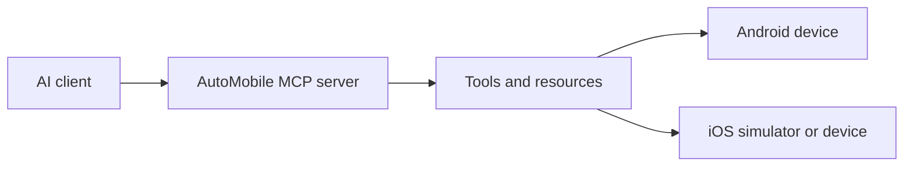

# System design

AutoMobile connects an MCP-compatible AI client to Android and iOS devices.

The client asks for an outcome. AutoMobile selects a device, observes its current
state, performs an action, and returns the new state. Device-specific runners
handle platform details so the client can use the same interaction model across
Android and iOS.

The main user-facing capabilities are:

- observe screens and accessibility information;
- tap, swipe, type, press buttons, and perform gestures;
- launch, install, and terminate apps;
- select and manage devices;
- execute repeatable plans and collect diagnostics.

Start with [installation](../index.md#install), then see the
[interaction loop](mcp/interaction-loop.md) for how AutoMobile observes,
acts, and returns updated state.

The [coordinate tools proposal](mcp/coordinate-tools.md) describes the draft
`tapAt`, `snapshotOf`, and `hitTest` workflow for views without useful selectors.
